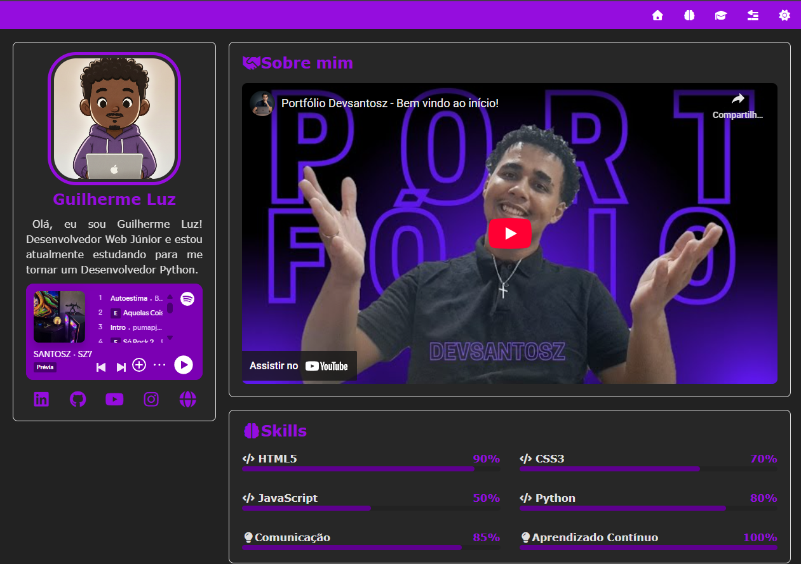

# Portfólio Pessoal

Projeto desenvolvido para apresentar meus projetos e habilidades como desenvolvedor web.

## 🚀 Tecnologias
- HTML5
- CSS3
- JavaScript

## 🎯 Objetivo
Aplicar conceitos de estrutura semântica, responsividade e organização de código.

## 📸 Preview

## 🔗 Deploy
https://devsantosz.github.io/Portfolio/
